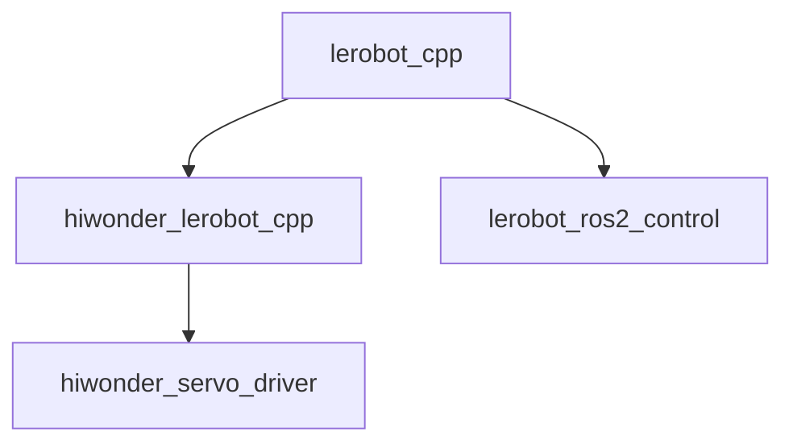
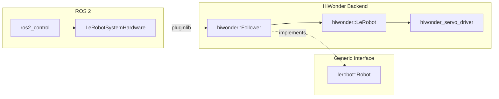

# hiwonder_ros2

[](https://github.com/KevinEppacher/hiwonder_ros2/actions/workflows/ci.yml)


ROS 2 support for HiWonder-based LeRobot platforms.

The project provides a C++ driver for HiWonder bus servos, a generic LeRobot
hardware interface, and `ros2_control` integration. The current implementation
supports the HiWonder SO-101 follower.

## Features

- C++20 driver for HiWonder bus servos
- Generic C++ interface for LeRobot hardware
- HiWonder SO-101 hardware backend
- `ros2_control` hardware interface
- Plugin-based robot backend using `pluginlib`
- SO-101 robot description and bringup
- Hardware setup, calibration, and diagnostic tools
- Pre-built Docker images for `amd64` and `arm64`
- Automated CI/CD using GitHub Actions

## Quick Start

The easiest way to run the SO-101 is using the pre-built Docker image.

The HiWonder controller is expected to be available at:

```text
/dev/ttyACM0
```

Pull the latest ROS 2 Jazzy image:

```bash
docker pull ghcr.io/kevineppacher/hiwonder_ros2:jazzy
```

Start the SO-101 follower:

```bash
docker run --rm -it \
    --device=/dev/ttyACM0 \
    --network=host \
    ghcr.io/kevineppacher/hiwonder_ros2:jazzy \
    ros2 launch lerobot_bringup so101_follower_bringup.launch.py \
    gui:=false \
    port:=/dev/ttyACM0
```

The container uses host networking so that ROS 2 nodes running inside the
container can communicate with ROS 2 nodes running on the host.

## Docker Compose

An example Docker Compose configuration is provided at:

```text
docs/docker-compose.yaml
```

Clone the repository:

```bash
git clone https://github.com/KevinEppacher/hiwonder_ros2.git
cd hiwonder_ros2
```

Start the SO-101 follower:

```bash
docker compose -f docs/docker-compose.yaml run --rm so101_bringup_service
```

The example Compose file also provides services for the included hardware
tools.

Scan the servo bus:

```bash
docker compose -f docs/docker-compose.yaml run --rm hiwonder-scan
```

Find the serial port:

```bash
docker compose -f docs/docker-compose.yaml run --rm hiwonder-find-port
```

Configure the SO-101 motors:

```bash
docker compose -f docs/docker-compose.yaml run --rm hiwonder-setup-motors
```

Calibrate the robot:

```bash
docker compose -f docs/docker-compose.yaml run --rm lerobot-calibrate
```

Test robot movement:

```bash
docker compose -f docs/docker-compose.yaml run --rm lerobot-test-move
```

Configure servo torque mode:

```bash
docker compose -f docs/docker-compose.yaml run --rm lerobot-torque-mode
```

## Manual Installation

The project currently targets Ubuntu 24.04 and ROS 2 Jazzy.

Create a ROS 2 workspace:

```bash
mkdir -p ~/ros2_ws/src
cd ~/ros2_ws/src
```

Clone the repository:

```bash
git clone https://github.com/KevinEppacher/hiwonder_ros2.git
```

Install the required dependencies:

```bash
cd ~/ros2_ws

rosdep install \
    --from-paths src \
    --ignore-src \
    -r \
    -y
```

Build the workspace:

```bash
colcon build --symlink-install
```

Source the workspace:

```bash
source install/setup.bash
```

The ROS 2 packages and command-line tools can now be used directly from the
host system.

## Packages

| Package | Description |
| --- | --- |
| `hiwonder_servo_driver` | C++ driver and command-line tools for HiWonder bus servos. |
| `lerobot_cpp` | Generic C++ interface for LeRobot hardware backends. |
| `hiwonder_lerobot_cpp` | HiWonder implementation of the generic LeRobot interface. |
| `lerobot_ros2_control` | Generic `ros2_control` hardware interface using a plugin-based robot backend. |
| `so101_follower_description` | URDF, configuration, and robot description for the SO-101 follower. |
| `lerobot_bringup` | ROS 2 launch and configuration files for the robot. |

## Architecture

The project separates the generic LeRobot interface, hardware-specific
implementations, and ROS 2 integration.



At runtime, `lerobot_ros2_control` loads the robot implementation through
`pluginlib`.



This keeps `lerobot_ros2_control` independent of the HiWonder servo protocol.
Additional hardware backends can implement the same `lerobot::Robot` interface
without modifying the generic ROS 2 control layer.

## HiWonder Backend

The HiWonder backend provides implementations for the LeRobot follower and
leader interfaces.

The currently available plugins are:

```text
hiwonder_lerobot_cpp/Follower
hiwonder_lerobot_cpp/Leader
```

The SO-101 follower uses six HiWonder bus servos:

| ID | Joint |
| ---: | --- |
| 1 | `shoulder_pan` |
| 2 | `shoulder_lift` |
| 3 | `elbow_flex` |
| 4 | `wrist_flex` |
| 5 | `wrist_roll` |
| 6 | `gripper` |

## Command-Line Tools

Several command-line tools are included for hardware setup, calibration, and
testing.

### `hiwonder-scan`

Scans the connected HiWonder servo bus for available servos.

```bash
hiwonder-scan <serial-port>
```

Example:

```bash
hiwonder-scan /dev/ttyACM0
```

### `hiwonder-scan-ports`

Searches for available serial ports that can communicate with the HiWonder
hardware.

```bash
hiwonder-scan-ports
```

### `hiwonder-setup-motors`

Configures the motors required by the SO-101.

```bash
hiwonder-setup-motors <serial-port>
```

Example:

```bash
hiwonder-setup-motors /dev/ttyACM0
```

### `lerobot-calibrate`

Runs the calibration procedure for the robot.

```bash
lerobot-calibrate <serial-port> <calibration-file>
```

Example:

```bash
lerobot-calibrate \
    /dev/ttyACM0 \
    <path-to-calibration.yaml>
```

### `lerobot-test-move`

Tests basic robot movement.

```bash
lerobot-test-move <serial-port>
```

Example:

```bash
lerobot-test-move /dev/ttyACM0
```

### `lerobot-torque-mode`

Configures the servo torque mode.

```bash
lerobot-torque-mode <serial-port>
```

Example:

```bash
lerobot-torque-mode /dev/ttyACM0
```

## ROS 2 Bringup

After building and sourcing the workspace, start the SO-101 follower with:

```bash
ros2 launch lerobot_bringup so101_follower_bringup.launch.py \
    gui:=false \
    port:=/dev/ttyACM0
```

The same launch file is used by the pre-built Docker image and the Docker
Compose configuration.

## Guiding Mode

The `ros2_control` hardware interface provides a guiding mode that allows the
robot arm to be moved manually.

Enable guiding mode:

```bash
ros2 service call \
    /<hardware_node>/guiding_mode \
    std_srvs/srv/SetBool \
    "{data: true}"
```

Disable guiding mode:

```bash
ros2 service call \
    /<hardware_node>/guiding_mode \
    std_srvs/srv/SetBool \
    "{data: false}"
```

When guiding mode is enabled, servo torque is disabled while the current joint
positions continue to be read by the hardware interface.

## Docker Images

Pre-built Docker images are published to the GitHub Container Registry:

```text
ghcr.io/kevineppacher/hiwonder_ros2:jazzy
```

The image is built for:

```text
linux/amd64
linux/arm64
```

This allows the same image tag to be used on standard x86-64 development
machines and ARM64 platforms such as the Raspberry Pi.

Docker automatically selects the correct image for the host architecture.

## Development

After making changes to the source code, build the workspace with:

```bash
colcon build --symlink-install
```

Run the tests with:

```bash
colcon test
colcon test-result --verbose
```

The repository uses automated checks for:

- C++ formatting with `ament_uncrustify`
- C++ linting with `ament_cpplint`
- Static analysis with `ament_cppcheck`
- XML validation with `ament_xmllint`
- Unit testing with GoogleTest

CI is executed automatically using GitHub Actions.

Successful builds of the `jazzy` branch are used to build and publish the
multi-architecture Docker image.

## License

This project is licensed under the Apache License 2.0.
