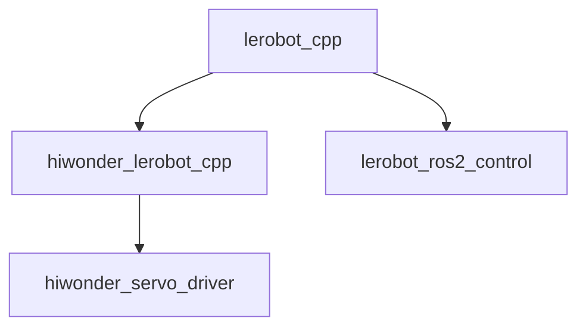
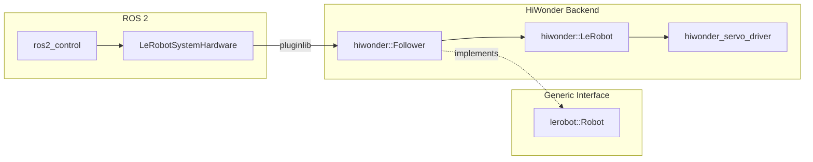

# hiwonder_ros2

[](https://github.com/KevinEppacher/hiwonder_ros2/actions/workflows/ci.yml)


ROS 2 support for HiWonder-based LeRobot platforms.

The project provides a C++ driver for HiWonder bus servos, a generic LeRobot
hardware interface, and `ros2_control` integration. The current implementation
supports the HiWonder SO-101 follower.

## Architecture

The project separates the generic LeRobot interface, hardware-specific
implementations, and ROS 2 integration.



At runtime, `lerobot_ros2_control` loads the robot implementation through
`pluginlib`.



This keeps `lerobot_ros2_control` independent of the HiWonder servo protocol and
allows additional hardware backends to implement the same `lerobot::Robot`
interface.

## Packages

| Package | Description |
| --- | --- |
| `hiwonder_servo_driver` | C++ driver for HiWonder bus servos. |
| `lerobot_cpp` | Generic C++ interface for LeRobot hardware backends. |
| `hiwonder_lerobot_cpp` | HiWonder implementation of the LeRobot interface. |
| `lerobot_ros2_control` | Generic `ros2_control` hardware interface using a plugin-based robot backend. |
| `so101_follower_description` | Robot description for the SO-101 follower. |
| `lerobot_bringup` | Launch and configuration files for the robot. |

## Installation

### Manual Installation

The project currently targets Ubuntu 24.04 and ROS 2 Jazzy.

Create a ROS 2 workspace and clone the repository:

```bash
mkdir -p ~/ros2_ws/src
cd ~/ros2_ws/src

git clone https://github.com/KevinEppacher/hiwonder_ros2.git
```

Install the required ROS dependencies:

```bash
cd ~/ros2_ws

rosdep install \
    --from-paths src \
    --ignore-src \
    -r \
    -y
```

Build the workspace:

```bash
colcon build --symlink-install
```

Source the workspace:

```bash
source install/setup.bash
```

### Docker Environment

The repository provides a Docker environment with ROS 2 Jazzy and the required
development dependencies.

Clone the repository:

```bash
git clone https://github.com/KevinEppacher/hiwonder_ros2.git
cd hiwonder_ros2
```

Start the container:

```bash
cd docker
docker compose up -d hiwonder_container
```

Open a shell inside the running container:

```bash
docker compose exec hiwonder_container bash
```

The workspace is available inside the container under:

```text
/app
```

## HiWonder Backend

The HiWonder backend currently provides plugins for the LeRobot follower and
leader:

```text
hiwonder_lerobot_cpp/Follower
hiwonder_lerobot_cpp/Leader
```

The SO-101 follower uses six bus servos:

| ID | Joint |
| ---: | --- |
| 1 | `shoulder_pan` |
| 2 | `shoulder_lift` |
| 3 | `elbow_flex` |
| 4 | `wrist_flex` |
| 5 | `wrist_roll` |
| 6 | `gripper` |

## Guiding Mode

The `ros2_control` hardware interface provides a guiding mode that allows the
robot arm to be moved manually.

Enable guiding mode:

```bash
ros2 service call \
    /<hardware_node>/guiding_mode \
    std_srvs/srv/SetBool \
    "{data: true}"
```

Disable guiding mode:

```bash
ros2 service call \
    /<hardware_node>/guiding_mode \
    std_srvs/srv/SetBool \
    "{data: false}"
```

When guiding mode is enabled, servo torque is disabled while the current joint
positions continue to be read.

## Tools

The repository provides command-line tools for working directly with the
HiWonder hardware.

### `hiwonder-scan`

Scans the connected HiWonder servo bus for available servos.

```bash
hiwonder-scan <serial-port>
```

For example:

```bash
hiwonder-scan /dev/ttyACM0
```

Additional tools are provided for robot setup and hardware interaction.

## License

This project is licensed under the Apache License 2.0.
